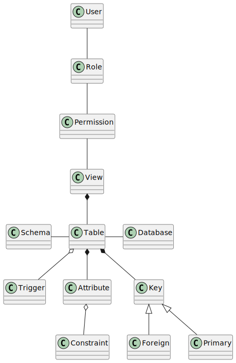
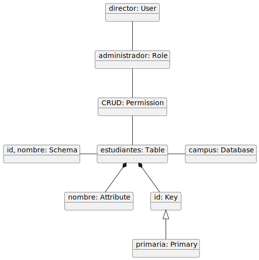
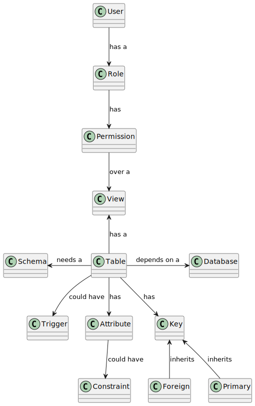
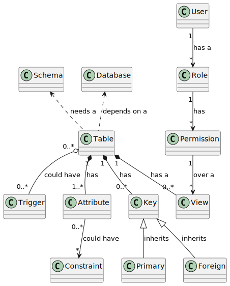
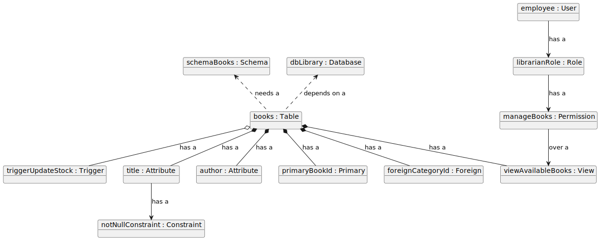
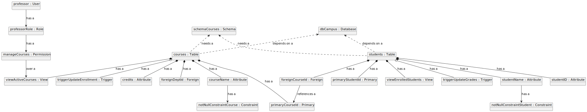

# Parcial de Ingeniería de Software - Tercera Parte

## Para contextualizar...

> Realiza un Modelo de Dominio de una Base de Datos Relacional

### Primera parte

En esta primera parte, el objetivo del [diagrama de clases](./modelUML/firstPartClass.puml) era representar la estructura, jerarquía y centralización de las entidades.

En esta iteración no se estaba contemplando la semántica completamente, mostraba incoherencias. Sin embargo, muestra qué elementos interactúan entre sí.

Se busca mostrar, desde el primer instante, que quien gobierna la **jerarquía** es el **usuario**, puesto que tiene un *poder* sobre las posibles acciones que puede tener sobre una **tabla**, la cual está **centralizada** porque es la entidad clave del diagrama. Dicho sea, sigue una **estructura** vertical para identificar el **flujo** de la *gestión* de la base de datos.

El [diagrama de objetos](./modelUML/firstPartObjects.puml), muy a mi pesar, está incompleto y no tiene todas las conexiones correctas, no está siendo fiel del todo al diagrama de clases puesto que omite *View*. Sin embargo, está casi implementado correctamente y congruentemente con el [diagrama de clases](./modelUML/firstPartClass.puml).

### Segunda parte

> xq' ∄ gramática explícita?

El objetivo de esta segunda fase del modelado de dominio, fue, como ejemplifiqué a papel, el de mostrar la intención de las relaciones entre las clases en el [diagrama](./modelUML/secondPartClass.puml), por lo que si bien no usa una gramática explícita, ejemplifica qué clase interactúa sobre otra.

---

## Tercera parte

### Diagrama de clases

Después de tomar el tiempo de analizar los diagramas que he presentado y siguiendo un hilo ante sus iteraciones, se presenta este [diagrama de clases](./modelUML/thirdPartClass.puml). Esto con el fin de resolver inconsistencias y mostrar correctamente la [semántica](https://plantuml.com/es/class-diagram) requerida:

| Tipo           | Símbolo   | Finalidad                                                |
| -------------- | --------- | -------------------------------------------------------- |
| Extensión      | ``<\|--`` | Especialización de una clase en una jerarquía (herencia) |
| Implementación | ``<\|..`` | Realización de una interfaz mediante una clase           |
| Composición    | ``*--``   | La parte no puede existir sin el todo                    |
| Agregación     | ``o--``   | La parte puede existir independientemente del todo       |
| Dependencia    | ``-->``   | El objeto utiliza otro objeto                            |
| Dependencia    | ``..>``   | Una forma más débil de dependencia                       |

Igualmente, se ajustó la cardinalidad para indicar la multiplicidad entre las relaciones.

Ciertamente, hubo un par de cambios en la estructura del diagrama:

- Tanto *Schema* como *Database* los eleve a nivel de estructura porque *Table* depende de ellos para su existencia.
- *View* ahora está por debajo y relacionado con *Table* puesto que la vista es la que depende de la tabla, luego debe mostrarse por debajo de dicha entidad.
- Es más expresiva la intención de centralizar *Table*.

De esta manera, somos fieles a la primera iteración, mostrando una evolución al momento de diagramar las clases.

### Diagrama de objetos

Para complementar nuestro diagrama de clases, se visualiza un caso coherente con la estructura y reglas del modelo con los diagramas de objetos para demostrar cómo se instanciarían y relacionarían las clases con dos ejemplos.

> Biblioteca

> Campus Universitario

